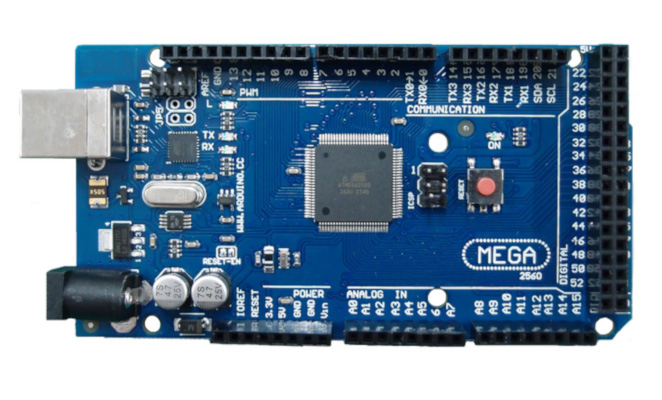

 


# Rapport projets Arduino 2018-2019

## Application de la Transformée de Fourier à l'affichage pratique et esthétique de contenu audio

### Auteurs : 
- Decottignies Thomas
- Picke Théo

### Responsable enseignant :
- Pascal Masson 

## Sommaire 
1. [**Motivations**](#motivations-)  
   - Pourquoi ce projet ?
   - Quelles applications ?
   - Comment le réaliser ?
  
2. [**Etablissement du cahier des charges**](#etablissement-du-cahier-des-charges-) 
   - Les fonctions
   - Le matériel

3. [**Recherches**](#recherches-) 
   - Etat de l'art
   - Dans notre contexte
  
4. [**Déroulement**](#deroulement-)
   - Se familiariser avec le matériel
   - Première version : TFR via Processing
   - Seconde version : TFR via l'Arduino
   - Améliorations esthétiques
  
5. [**Rendu**](#rendu-)
   - Comparaison au cahier des charges
   - Améliorations possibles 
   - Ouverture à d'autres applications 
   
6. **Contributions et remerciements**

# Motivations :

## Pourquoi ce projet ?
### La puce **Arduino** :
   Dans le cadre du cours d'électronique, nous avons eu l'occasion de faire preuve de créativité dans un sujet libre utilisant les capacités que nous offre Arduino et ses composants. Une carte Arduino est une puce programmable possédant au minima des entrées/sorties numériques/analogiques et une prise USB. Elle fonctionne selon un principe simple : un signal reçu depuis une entrée déclenche une ou des actions, définies dans un programme enregistré dans la carte. Il est possible d'y connecter une batterie d'appareils capables d'acquérir des données (capteurs) et de moyens permettants à la puce d'intéragir avec le monde extérieur(led, moteurs etc...). Nous ferons le long de ce projet l'abus de langage "l'Arduino" pour designer la puce Arduino, ce terme désignant en réalité l'écosystème Arduino. 
   Dans notre cas , nous simplifierons le fonctionnement de l'Arduino selon le principe suivant :

> **Réception --> Traitement --> Action**

### Les contraintes :
   Malgré la certaine liberté dont nous disposons, nous sommes tenus de respecter les contraintes suivantes :
- La faisabilité : il s'agit de mettre en pratique et d'approfondir nos connaissances. Nous devons veiller à ne pas être trop ambitieux et rester conscients de ce qui relève de notre niveau de compétence.
- Le coût : le budget de l'ecole n'étant pas illimité il faut veiller à ce que les sommes dépensées soient en commune mesure avec la nature du projet.
- Le temps : nous disposons d'un semestre et demi pour mener le projet à son terme. Toutefois, si des difficultés techniques sont rencontrées, il est possible de minimiser la pénalisation en faisant preuve de d'ingéniosité et en proposant des solutions.
- L'utilisation d'une connexion radiofréquence est imposée (ex : Bluetooth).

### Idée et intérêts personnels :
   Il s'est passé deux semaines entre le moment où nous avons formé les binômes et celui où nous avons fixé le sujet. Nous avions une multitude de projets possibles parmi lesquels : 
- Des baskets GPS
- Un stabilisateur de chute
- Un trieur d'objets adaptatif
- Un trackpad laser pour PC

   Toutefois nous avons rencontré un certain nombre de difficultés techniques qui semblaient compromettre une à une nos idées.
La confirmation de notre projet nous est venue avant tout de nos intérêts respectifs. Comment concilier musique, approche mathématique et programmation ? En nous penchant sur les vastes capacités que nous offre Arduino nous avons fini par nous accorder sur la création d'un afficheur de fréquence tel qu'on en trouve sur n'importe quel équaliseur , en ayant une vague notion de ce qu'est la transformation de Fourier (merci l'utilisation de l'oscilloscope).

## Quelles applications ?

### Utilité au quotidien
   Le premier exemple qui nous est venu, étant tous les deux musiciens, est le fonctionnement d'un accordeur. Un son émis par l'instrument est capté par un micro (sonore ou à vibrations), analysé en fréquences et un affichage de la fréquence actuelle constitue la note jouée. C'est le même principe lorsqu'il s'agit de régler l'équilibrage des différentes enceintes d'un home cinéma par exemple. La mesure des différentes fréquences permet d'avoir une balance entre grave et aigus adaptés au type de divertissement. D'autres applications dans les sciences existent pour l'analyse de systèmes mécaniques.

## Comment le réaliser ?
### Les ressources
   Sans avoir étudié en détail les caractéristiques du système, nous savons qu'il nous faut un capteur pour l'acquisition du son, un boitier d'acquisition, un logiciel de traitement et enfin un écran.
Un lot d'écrans LED etait déjà à notre disposition en salle de TP, nous avons donc décidé de les utiliser.

### Le principe
   Le coeur du projet repose sur un opérateur qu'est la Transformation de Fourier Rapide (TFR) : il s'agit d'un algorithme de la Transformation de Fourier Discrète (TFD). La TFD est une méthode permettant de réaliser une transformée de Fourier pour un signal sur une durée finie que l'on échantillonne en fonction du temps. La transformation de Fourier rapide n'est qu'un algorithme de cette même transformation qui nécessite un nombre d'opérations beaucoup moindre pour les grands échantillons. Cette méthode nous permet donc de réaliser les transformations de Fourier Discrètes plus rapidement.
   Le fonctionnement de la FFT nous pose toutefois un problème. Etant très gourmande en ressources, nous sommes conscients que la faible puissance de calcul de l'arduino peut être un frein à la réalisation d'un programme devant gérer à la fois l'affichage sur l'écran LCD et les calculs liés à la TFR. Nous avons dans un premier temps pensé à l'utilisation d'un PC afin de déléguer les calculs à un processeur plus puissant. Nous avons également à disposition des cartes Arduino Mega et Due, qui devraient en théorie être assez puissante pour réaliser des TFR sommaires.


# Etablissement du cahier des charges :
## Découpage en fonctions
   Afin de rédiger le cahier des charges (consultable [ici](/CDC.md)), nous avons choisi de découper notre projet en étapes simples que nous tâcherons de réaliser et mettre en relations entre elles par la suite :
### 1. L'affichage :
   Afin d'afficher correctement les résultats de notre programme, il est essentiel de maîtriser les possibilités d'affichage que nous à notre disposition. Nous devons réfléchir à la fois à un affichage clair, intelligible et esthétique. Pour cela le tracé de formes géométriques , de droites et l'affichage de données sur l'écran constituent des éléments de base à acquérir pour travailler sur le rendu final.
### 2. La communication radio-fréquence :
   Les différentes composantes de notre projet étant fixes, les connections utilisées auraient pu être réalisées de façon filiaire. Toutefois afin de respecter les contraintes du projet, nous allons mettre en place un connexion Bluetooth dont nous avons étudié le fonctionnement auparavant. Cette connexion servira d'intermédiaire entre le traitement et l'affichage des données.
### 3. Opérer une Transformation de Fourier Rapide sur le signal d'entrée:
Nous devons réaliser une TFR sur un signal provenant de différentes sources numériques (fichier audio) et analogiques (micro). C'est à ce moment que nous avons pris la décision de réaliser dans un premier temps une TFR sur le logiciel Processing (sur pc) et de revenir à un traitement unique sur Arduino plus tard. En effet, nous avions un doute quant à la capacité d'un Arduino à effectuer la TFR assez rapidement. 

## Le matériel
Une grande partie du matériel nécessaire à la réalisation de notre projet etait déjà à notre disposition parmi :
- [x] Arduino mega 



- [x] Une allimentation filaire
- [x] Ecran led Adafruit Industries 32*64


- [x] Un ordinateur portable
- [x] Un micro type ky-037


- [x] Une puce BT HC-06


Des éléments mineurs à acheter : 
- [ ] Une boite afin de contenir tous les élément de notre projet 
- [ ] De la colle à bois
- [ ] Du scotch double face isolant

# Recherches :
## L'état de l'art
   Pour la réalisation de notre projet, nous avons pu nous appuyer sur ce qui avait déjà été réalisé par le passé.
### 1. Le montage
   Afin de relier l'écran à l'Arduino, il était nécessaire de réaliser un montage adapté. Heureusement, sur le site [Adafruit Industries](https://www.adafruit.com/product/2279), des indications précises pour tout type d'Arduino étaient présentes. Le module Bluetooth HC-06 est connecté en port communication et le micro ky-037 que nous avons obtenu par la suite nécessite une tension de 5V ainsi qu'une PIN Analog. Nous avons donc pu terminer sans mal ce qui concernait le montage, qui représente seulement une partie mineure de notre projet. 
### 2. Les programmes et librairies
   Après quelques recherches, nous nous sommes rendus compte que la TFR était un algorithme trop complexe pour que nous puissons le programmer par nous-même dans le temps imposé. Nous allions donc avoir également besoin de librairies déjà faites permettant de les réaliser. Ces librairies étaient déja implémentées dans les IDE que nous utilisions. Nous allions également pouvoir faire usage des programmes déjà existants utilisant ces librairies, à la condition de les modifier pour les adapter au contexte.

## Dans notre contexte
   L'Arduino possède un cadre d'application "type", une donnée à traiter déclenche une action. Ce principe est ce que nous attendons pour la réalisation de notre projet. Les données brutes (signaux sonores) doivent être traitées et leur résultat déclenche l'action d'affichage. Dans ce cas précis l'Arduino est une plateforme suffisante et peu coûteuse pour la réalisation du projet.

# Deroulement :
## Se familiariser avec le matériel
### 1. Premières séances:
   Notre professeur encadrant, connaissant notre sujet, a mis à notre disposition un écran LED 64X32 Pixels de marque Adafruit ainsi que l'alimentation correspondante. Pour la carte Arduino nous avons utilisé une carte MEGA 2560 possédant un plus grand nombre de ports et nous permettant d'anticiper un éventuel déficit de puissance de traitement. En recherchant la documentation liée à l'écran, nous sommes tombés sur le site officiel d'Adafruit Industries qui met en lien dans la description du produit une notice de branchement ainsi qu'un lien vers des exemples de programmes utilisant leur librairie. Les branchements détaillés sur [cette page](https://learn.adafruit.com/32x16-32x32-rgb-led-matrix/connecting-with-jumper-wires) nous ont permis d'éxecuter nos premiers affichages. Cet écran pour fonctionner nécessite deux librairies :

1. [RGB Matrix pannel library](https://github.com/adafruit/RGB-matrix-Panel)
2. [Adafruit GFX Library](https://github.com/adafruit/Adafruit-GFX-Library)

   Une fois ces deux librairies installées sur l'IDE Arduino, des fichiers tests étaient présents dans la section "exemples" de l'IDE et nous avons pu appréhender les premières fonctions que nous offrent l'écran, parmis lesquelles: 
- color = matrix.color333(R,V,B) : renvoie une couleur formée par synthèse additive des trois composantes rouge vert bleu .
- matrix.drawPixel(x, y, color) : dessine un Pixel en (x,y) .
- matrix.fillRect(x, y, L, l, color) : dessine un rectangle plein en (x,y) de longueur L et de hauteur l.
- matrix.drawRect(x, y, L, l, color) : dessine un rectangle vide en (x,y) de longueur L et de hauteur l.
- matrix.drawLine(x1, y1, x2, y2, color) : dessine une ligne entre les points (x1,y1) et (x2,y2).
- matrix.drawCircle(x, y, R, color) : dessine une cercle de centre (x,y) er de rayon R.
- matrix.fillCircle(x, y, R, color) : dessine un disque de centre (x,y) et de rayon R.
- matrix.fillScreen(color) : remplit l'écran de la couleur color (réinitialise l'écran si la couleur est noire).

Notre premier programme test de l'écran fut un magnifique sapin de noël dont l'étoile à son sommet clignote .


   Par la suite, nous avons établi la connexion Bluetooth de l'arduino à l'aide du même module HC-06 que nous utilisions en cours ainsi que son programme de setup [commBT.ino](/Rendu%20Final/commBT). Nous avions au passage découvert les ports communication de la carte MEGA qui ne figuraient pas sur notre modèle d'apprentissage. Ces ports nous permettent principalement d'éviter d'avoir à déclarer des variables pour les branchements des RX et TX de l'arduino et de l'utiliser comme un port communication (ici com3 par exemple). Pour tester la connexions BT en même temps que nos capacités d'affichage en temps réel sur l'écran, nous avions choisi d'afficher un cercle dont nous faisions varier en temps réel le rayon sur un téléphone avec l'application [Bluetooth Electronics](http://www.keuwl.com/apps/bluetoothelectronics/). Le programme nommé [led32X64.ino](/Rendu%20Final/led34X64) nous a donné une information capitale sur les caractéristiques que nous attendions du Bluetooth dans ce projet : la rapidité. En effet lors des premiers tests de variation du rayon du cercle, nous avions remarqué une lattence importante. Une modification de la vitesse de communication du BT à l'aide du programme cité précédemment et de la commande :

> AT+BAUD6 (à écrire dans le moniteur série)

nous a permis d'augmenter la vitesse de communication du HC-06 à 38400. Nous avions également augmenté la vitesse de communication côté écran :

` serial3.begin(38400); `

Etant donné que nous utilisions notre unique téléphone avec l'application, nous n'avons pas pu prendre de vidéo des tests.

Maintenant que nous avions pris en main toutes les fonctions principales de notre projet, nous pouvions nous attaquer à la TFR.

## TFR via Processing
### 1. Une première méthode pour réaliser une TFR

   Après avoir testé plusieurs librairies Arduino pour éxecuter la TFR, nous avions choisi d'utiliser le logiciel Processing sur PC et de revenir a un traitement FFT via arduino plus tard. Toutes les méthodes que nous avons trouvés utlisaient un PC pour le partie traitement, avant d'envoyer le résultat à l'Arduino.
   Notre premier essai d'affichage des fréquences utilise la librairie [Minim](http://code.compartmental.net/tools/minim/) de Processing qui permet la lecture de fichiers audios et dispose d'outils de traitement du signal. Dans cette première version Processing "découpe" le signal en fréquences et utilise l'intensité obtenue pour définir la taille des pics à dessiner. Pour se faire nous avons créé une matrice(Array) avec l'ensemble des valeurs à afficher.
   Une fois le traitement effectué, les informations sont envoyées à l'Arduino qui dessine (methode draw) les pics. 
Nous nous sommes en grande partie inspirés des travaux du Github [Afreiday](https://github.com/afreiday) , et la plus grosse modification à effectuer était de lire un fichier audio plutot qu'une sortie d'une carte son par exemple.
   Pour l'instant la connection est filaire mais nous avons déjà préparé un module bluetooth par lequel transitera l'information. La communication sans fil repose sur la possibilité qu'offre windows 10 de sélectionner et éditer les Ports sur lesquels se connectent les périphériques. Après une première connection , tout périphérique se voit attribuer un numéro COM et est enregistré. Par la suite nous avons utilisé ce numéro pour se connecter à l'Arduino et lui envoyer les données traitées :

`String serial_port = "COM13"; //set the out port to send data from the FFT (uses Bluetooth port from windows configuration pannel)`

La source du signal audio est un objet de tye Minim dont nous signalons avant de compiler et d'éxecuter le programme la source :

` in = minim.loadFile("centipede.mp3"); //set the minim source from the file (must be an mp3 in the same directory) `

   Le résultat, bien que non adapté à la taille de notre écran est très concluant. Le traitement est quasi instantané et peut être visionné [ici](https://youtu.be/rAYWvyrwPwg).

### 2. Principe :

   Cette méthode repose sur l'utilisation de deux programmes qui fonctionnent de concert :
- [processFFT.pde](/Rendu%20Final/processFFT): 
   Le programme récupère en entrée un fichier mp3 et le convertit en objet minim. La FFT est effectué sur l'objet et nous récupérons un couple de valeurs fréquence et amplitude . Les fréquences sont triées et adaptées à la dimension des sections que nous imposons (il est difficile de représenter sur un écran de longueur 64 pix une plage de fréquence de 20hz à 20Khz). Après avoir fait une moyenne des valeurs obtenues sur chaque plages , nous initialisons un tableau contenant toutes les valeurs possibles :
```
for (int j = 0; j < num_levels; j++) {
         if (freq_height[j] < 200000 && freq_height[j] > 200) { freq_array[j] = 16; }
    else if (freq_height[j] <= 300 && freq_height[j] > 150)   { freq_array[j] = 15; }
    else if (freq_height[j] <= 250 && freq_height[j] > 125)   { freq_array[j] = 14; }
    else if (freq_height[j] <= 200 && freq_height[j] > 100)   { freq_array[j] = 13; }
    else if (freq_height[j] <= 160 && freq_height[j] > 90)    { freq_array[j] = 12; }
    else if (freq_height[j] <= 150 && freq_height[j] > 75)    { freq_array[j] = 11; }
    else if (freq_height[j] <= 140 && freq_height[j] > 65)    { freq_array[j] = 10; }
    else if (freq_height[j] <= 120 && freq_height[j] > 50)    { freq_array[j] = 9; }
    else if (freq_height[j] <= 50 && freq_height[j] > 45)     { freq_array[j] = 8; }
    else if (freq_height[j] <= 45 && freq_height[j] > 40)     { freq_array[j] = 7; }
    else if (freq_height[j] <= 40 && freq_height[j] > 35)     { freq_array[j] = 6; }
    else if (freq_height[j] <= 35 && freq_height[j] > 30)     { freq_array[j] = 5; }
    else if (freq_height[j] <= 30 && freq_height[j] > 15)     { freq_array[j] = 4; }
    else if (freq_height[j] <= 15 && freq_height[j] > 10)     { freq_array[j] = 3; }
    else if (freq_height[j] <= 10 && freq_height[j] > 5)      { freq_array[j] = 2; }
    else if (freq_height[j] <= 5 && freq_height[j] >= 1)      { freq_array[j] = 1; }
    else if (freq_height[j] < 1 )                             { freq_array[j] = 0; }
}
```
Par la suite , chaque valeur de fréquence corresondante à l'une de celles du tableau est envoyé sous la forme :
> array[freq] : amplitude

- [affFFT.ino](/Rendu%20Final/affFFT):
   L'Arduino récupère les informations envoyées par processing en Bluetooth sur le port com3 et les traîte en divisant le signal reçu en deux sous-chaînes dont le séparateur est ":". 
```
  while (Serial3.available() > 0) {  //get FFT data from BT 
    
    String in = Serial3.readStringUntil('\n');

    int f = in.substring(0, in.indexOf(sep)).toInt();  //stands for the first part of the data (before ":") frequency 
    int ff = in.substring(in.indexOf(sep) + sep.length()).toInt(); //stands for the second part of data : range 
```
   Les valeurs sont ensuites affichées sur l'écran sous forme de lignes verticales à l'aide de la méthode matrix.drawPixel qui dessine un pixel noir si la valeur précédente n'est plus attribuée, bleu s'il s'agit d'une nouvelle valeur , jaune si elle dépasse un certain seuil. 

## 2nd Programme : TFR via l'Arduino
### 1. Nouvelle librairie, nouveau concept :
   A ce stade , la première version utilisant un PC est proche de la complétion. Hormis quelques détails esthétiques, nous décidons de s'attaquer à un tout autre problème : réaliser la TFR en n'utilisant que la puissance de traitement de l'Arduino. Là était pour nous le véritable challenge étant donné que pléthore de méthodes de FFT classiques existaient déja sur le web mais aucune n'était restreinte aux capacités seules de l'arduino. C'est alors que nous avons découvert une nouvelle librairie [fft.h](https://github.com/kosme/arduinoFFT) de traitement dit "à points fixes". Mois gourmande en opérations élémentaires et implémentées dans l'IDE Arduino , cette méthode avait des avantages suffisants pour commencer une nouvelle version de notre projet.
### 2. Principe :
   La TFR à points fixes fonctionne sur le principe suivant : Un sample du signal envoyé en entrée est capturé, il est analysé en moyenne sur cet intervalle de temps et un unique couple de valeurs fréquence:amplitude est récupéré. Bien moins précise, cette méthode permet néanmoins de contourner les limites techniques de la carte méga et ses 16Mhz de vitesse de calcul. 

### 3. spectrum.ino

L'Arduino prend en entrée un signal analogique depuis la PIN 8, et capture un échantillon de taille 128
 ```
  int min=1024, max=0;                                //set minumum & maximum ADC value
  for (i = 0; i < 128; i++) {                         //take 128 samples
    val = analogRead(A8)*50 ;                             //get audio from Analog serial 
    Serial.println(val , DEC);
    data[i] = val / 4 - 128;                          //each element of array is val/4-128
    im[i] = 0;                                        //
    if(val>max) max=val;                              //capture maximum level
    if(val<min) min=val;                              //capture minimum level
   ```
   L'Arduino effectue ensuite la FFT sur l'échantillon récupéré précédement, et affiche son résultat en différé.
Le nombre de fois ou l'Arduino peut effectuer cette opération par seconde est proportionnelle à la vitesse de son proceseur.
   
   Le programme affiche ensuite le résultat sous forme de lignes bleues via la fonction matrix.drawLine.
Nous avons rencontré une série de problèmes qui ont retardé notre avancée. En effet , le microphone qui nous a été fourni présentait un défaut et pas des moindres , il ne laissait pas passer le courant et fonctionnait comme interrupteur ouvert. Le problème c'est que nous ne pouvions pas détecter si notre programme etait en cause ou le micro que nous n'avions pas suspecté. Après un test simple en mettant le micro en série avec une LED , nos avons cstaté son disfonctionnement et l'avons remplacé. Second problème , le gain de sortie du micro est extrêmement faible . N'etant pas équipé d'un amplificateur de qualité , nous avons eu recours à une manipulatin logicielle qui consiste à multiplier l'entrée analogique par une constante élevée (x50), multipliant au passage le bruit du micro et donc en sacrifiant encore en précision. 

## Améliorations esthétiques
### 1. Construction du support
[Boite](https://github.com/reviserCtricher/Peip2-Arduino/blob/master/Compte%20Rendu%20Th%C3%A9o/Boite%20Arduino.pdf)
### 2. De nouveaux types d'affichages
   Une fois les différentes méthodes pour réaliser la FFT terminée, nous avons suivi notre cahier des charges en décidant de créer de nouveaux types d'affichages et d'améliorer ceux déja existants. Pour cela, nous avons commencé par créer un nouveau type d'affichage pour [spectrum.ino](/Rendu%20Final/spectrum).
   Cette méthode d'affichage vise à limiter l'impact visuel du bruit, et augmenter la visibilité des signaux que nous arrivions à capter en branchant directement l'Arduino à un GBF. Il existe plusieurs versions de ce programme, ou on fait varier le nombre de cercles et ou affiche le résultat sur deux écrans, mais le principe est semblable. Elle récupère un certain nombre d'échantillons, et récupère le maximum d'amplitude parmis les valeurs de l'échantillon. Elle affiche le résultat sont forme d'un cercle par échantillon de fréquence dont le rayon varie en fonction du maximum obtenu. Lorsque ce maximum dépasse un seuil, le cercle devient en partie jaune :
vidéo disponible [ici](https://youtu.be/8QeODw8Q2Pk)
``` for(int i=0 ; i<8; i++){
    int maxi=0;
    for(int j=i*4+1 ; j<i*4+5 ; j++){ // même chose pour j
      int dat = sqrt(data[j] * data[j] + im[j] * im[j]);
      if(dat>maxi){maxi=dat;}
    }
     if(maxi>7){
        matrix.fillCircle(i*7+8 , (i%2)*12+10 , maxi/5 , matrix.Color333(0 , 0 ,7)); // Le cercle sera affiché dans la moitié
        matrix.fillCircle(i*7+8 , (i%2)*12+10 , 2 , matrix.Color333(0 , 7 ,0)); // supérieure de l'écran une fois sur deux,
      }
      else{
        matrix.fillCircle(i*7+8 , (i%2)*12+10 , maxi/5 , matrix.Color333(0 , 7 ,0)); // sinon il sera affiché dans la moitié inférieure
      }
} 
```
   Une fois cette version réalisée, nous avons décidé d'en créer une semblable pour Processing. Il a fallu modifier le programme, car Processing ne traite pas les informations ni de la même façon ni dans le même ordre. Le principe d'affichage reste le même, mais la vitesse de traitement est plus élevée.
Vidéo disponible [ici](https://youtu.be/0CFA_ttialM)
Enfin, nous avons créé une dernière version pour processFFT.pde à but purement esthétique. Attention, épileptiques s'abstenir ! 
Vidéo disponible [ici](https://youtu.be/8qS_j6wB5zk)

# Rendu :
En définitive , nous avons deux versions fonctionnelles de notre projet. La première utilisant processing est rapide et efficace sur un très grand éventail de fréquence s'étendant sur l'ensemble du spectre audible et au delà. Cette versions en temps réel peut être utilisée à des fins professionnelles et constitue un produit fini auquel il est possible d'attribuer des fonctions concrètes de traitement et d'affichage du signal. La seconde sous arduino , bien que plus lente et moins précise est satisfaisante compte tenu de ce que nous nous attendions à réaliser au moment de l'établissement de notre cahier des charges. 

De nombreuses améliorations de nos projets sont possibles afin d'optimiser les performances et simplicité d'utilisation parmi lesquelles :

- L'utilisation d'un Arduino plus puissant pour la seconde version de notre projet. En effet, nous avons envisagé de passer sous Arduino Due cadencé à plus de 80 Mhz afin d'augmenter la fréquence de traitement et donc la précision , mais cette puce possède un proceceur ARM non compatible avec la librairie fft.h sur laquelle repose notre travail. Il serait possible de contourner ce problème en codant nous même une librairie compatible avec ARM en se basant sur les modules de FFT déjà existants. Cette amélioration bien que envisagée n'a pas été possible par manque de temps et surtout de connaissances sur la création de librairies.

- L'utilisation de la plateforme Android en permettant à l'utilisateur de streamer en temps réel du contenu audio depuis son smartphone. Pour cela, il aurait fallu envisager la cration d'une application Android ou l'utilisation de MIT App Inventor qui prend en charge le Module BT HC-06 tel un périphérique média pour streamer du contenu et le traiter avec notre programme spectrum à la place de l'entrée analogique. Une autre méthode plus ambitieuse serait de faire tourner le programme Processing sur le téléphone android (en sandbox ou à l'aide de javascript) et d'effectuer tout le traitement sur le smartphone avant d'envoyer les données traitées sur l'arduino. Pour le moment, il n'existe aucune version de processing sur Android prenant en charge l'utilisation de librairies telles que minim.

- La modification de la fréquence d'échantillonage des pins analogiques de l'arduino afin de tirer pleinement profit des possibilités du micro. En effet les valeurs d'usine et les caractéristiques des entrées de l'arduino sont modifiables (aux risques de l'utilisateur) . Des ébauches de réponse quant à cette méthode peuvent être trouvées [ici](http://www.gammon.com.au/adc) et parlent d'un réglage pour des fréquences allant de 125 à 8000 khz mais cela 
concerne l'ensemble des prescaleurs de l'arduino pouvant rentrer enconflit avec notre matériel et nos librairies.
 
# Contributions et remerciements :
Ce projet, en plus de conforter un plan professionel nous a permis d'acquérir des connaissances pratiques sur la gestion de travaux en se rapprochant au maximum des conditions de travail réel d'un ingénieur. En laissant libre cours à notre créativité nous avons pu apporter des solutions concrêtes aux problèmes successifs que nous avons rencontrés et avons mis en pratique l'ensemble des connaissances que nous avons acquises au cours de nos parcours respectifs. 
Nous remercions monsieur Pascal Masson pour son aide à la concrétisation de ce projet ainsi que toutes l'équpe enseignante de Polytech Nice Sophia présente au cours des séances et lors de nos évaluations.


